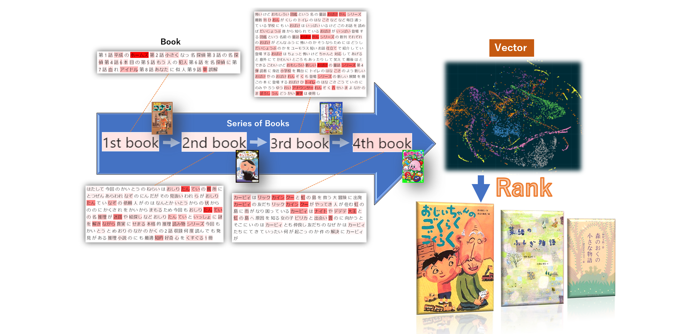
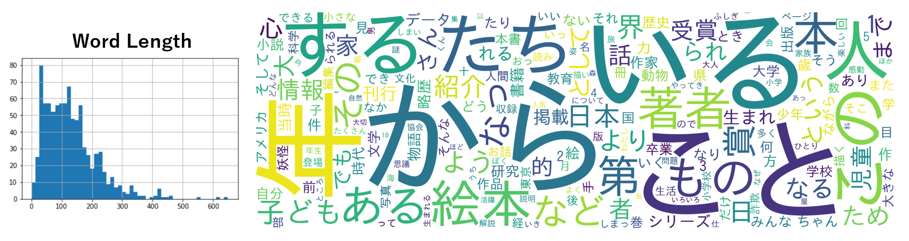
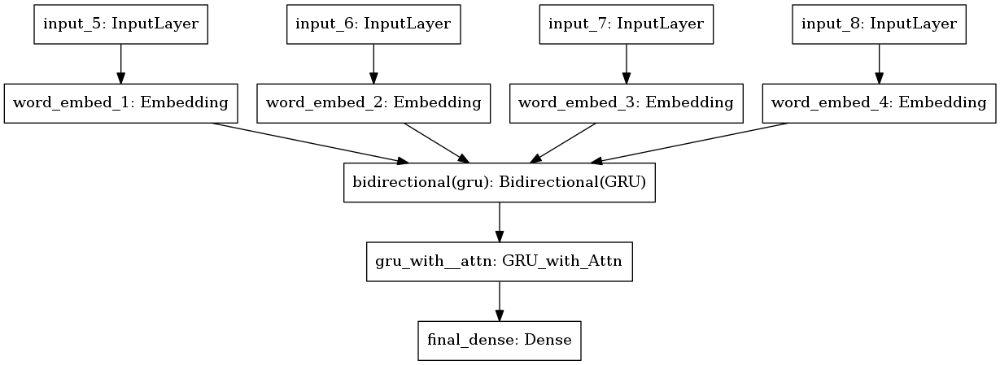
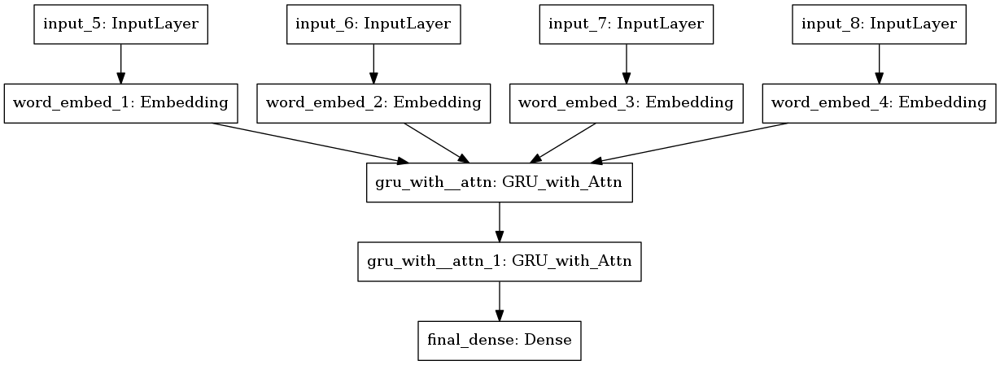
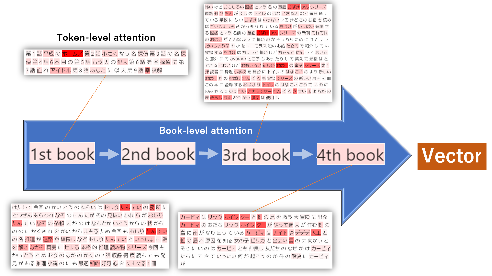

Tosho Recommender
=====  
**NLP** book recommender system using a series of book descriptions.  

  

Problem
----  
  
At my daughter's Japanese Saturday school (日本語補習校), students and parents often have no idea what books to borrow from the library.  
- There are too many books (**Over 5,000**)
- They don't have enough time to decide (**30 min / week**)
- There is **no website** that shows what books are available

Solution
----  
Build an **NLP** book recommender system using a series of book descriptions!  
1. Encode each book, which consists of book descriptions (=a bunch of words).  
2. Encode a series of books (=book history).  
3. Output a vector.
4. Recommend similar books based on cosine similarity.
  

Use Cases
----  
1. Recommend books based on user's book history.
2. Pick a single book, and find similar books.
3. Pick multiple **new** books (or a single **new** book) that are **not in the library**, and find similar books that are available in the library. (See `Step 10` under `Instructions` for a demo)

Data
----  
**Tables**  
- User table

user_id | parent_id (if child)
--- | --- 
0000002 | NULL
0000003 | 0000002

- Book table

book_id | category | title | ISBN | user_id | counter (how many times the book has been borrowed)
--- | --- | --- | --- | --- | ---
1000001 | A | ドラえもん | 9876543210123 | 0000002 | 3
1000002 | B | 桃太郎 | 9876543210124 | 0000002 | 1


- Book History table  
`***there was no transaction table, so I created my own book history table.`

user_id | book_id | timestamp
--- | --- | ---
0000002 | 1000001 | 2018-05-01 00:00:00
0000002 | 1000002 | 2018-05-01 00:00:00
0000003 | 1000001 | 2018-05-08 00:00:00

**Sampling**  
For this prototype, I used only 5 books per user based on their recent history. 

. | whole data | sample 
--- | --- | ---
Number of users | 508 | 282
Number of books | 5103 | 891

Instructions
----  
1. Build a training environment   
    1.  
    ```bash
    cd docker/training
    ```  
    2.  
    ```bash
    docker build . -t yuibi/tosho_recommender_training:1.0
    ```  
    3.  
    ```bash
    NV_GPU=0 nvidia-docker run -d --name `whoami`_tosho_recommender_training --rm -p 8888:8888 -v ~:/workspace yuibi/tosho_recommender_training:1.0
    ```  
    4. Open JupyterLab at `https://localhost:8888`  
2. Collect data ([notebook](https://github.com/yuibi/tosho_recommender/blob/master/code/Tosho_Data_Collection.ipynb))
    1. Export database tables as csv
    2. Load the csv file
    3. Web scrape book descriptions
    4. Clean and tokenize (分かち書き) Japanese text
3. Basic stats ([notebook](https://github.com/yuibi/tosho_recommender/blob/master/code/Tosho_Word_Freq_Word_Cloud.ipynb))  
    1. Word length
    2. Word frequency
  
4. Create book-level representation (ETL, Hyperparameter) ([notebook](https://github.com/yuibi/tosho_recommender/blob/master/code/Tosho_Book_Representation_ETL_Hyperparam_Architecture.ipynb))  
    1. Augument data (generate permutations of users' book history)
    2. Use `mean of FastText vectors` as label & `cosine similarity` as loss
    3. Implement [self-attention](https://github.com/yuibi/tosho_recommender/blob/master/code/model.py) (A Structured Self-attentive Sentence Embedding (Lin, et al., 2017)) 
    4. Use [optuna](https://github.com/pfnet/optuna) (Akiba, et al., 2019) for hyperparameter and architecture optimization
5. Create book-level representation (Train) ([notebook](https://github.com/yuibi/tosho_recommender/blob/master/code/Tosho_Book_Representation_Train.ipynb))  
    1. Train
    2. Extract intermediary layer for book-level representation
   
6. Create book-level representation (Validation) ([notebook](https://github.com/yuibi/tosho_recommender/blob/master/code/Tosho_Book_Representation_Validation.ipynb)) 
    1. Use T-SNE to visualize book-level representation
    2. Convert it into Word2Vec (gensim) format
    3. Spot check to see if book similarity is captured. e.g. The following example shows Kindergarten books are closer in terms of cosine similarity:
```python
Random book ID: 3901495
Description: むかし あし がら 山 の 山 お くに きん という とても げんき 男 の こ が い きん は うまれ とき から ちか ら もち はじめて のめ いさ くえ ほん シリーズ 幼児 向け 厚紙 絵本
1st similar book ID: 3901619
1st similar book description: おじいさん が おむすび を 食べよ と する と おむすび は ころころ ころころ ころがっ て あな の へ す とんと おち て しまい はじめて のめ いさ くえ ほん シリーズ 幼児 向け 厚紙 絵本
2nd similar book ID: 3901620
2nd similar book description: ある ひ かあさん ぶた が いい みんな も 大きく なっ から ぶん で 家 を たて なさい はじめて のめ いさ くえ ほん シリーズ 幼児 向け 厚紙 絵本
```
7. Create book-level representation (Tensorboard) ([notebook](https://github.com/yuibi/tosho_recommender/blob/master/code/Tosho_Book_Representation_Tensorboard.ipynb)) 
    1. Use book cover images as sprites
    2. Visualize in Tensorboard (see the animation at the top of this page for a demo)  
8. Build a book recommender (Hyperparameter) ([notebook](https://github.com/yuibi/tosho_recommender/blob/master/code/Tosho_Recommender_Hyperparam_Architecture.ipynb))  
    1. Use `book-level vector representation` as label
    2. Use [optuna](https://github.com/pfnet/optuna) for hyperparameter and architecture optimization.
9. Build a book recommender (Train) ([notebook](https://github.com/yuibi/tosho_recommender/blob/master/code/Tosho_Recommender_Train.ipynb))  
    1. Train
    2. Spot check
   
10. Dockerize and build a REST API for inference   
    1.  
    ```bash
    cd docker/tosho_recommender
    ```  
    2.  
    ```bash
    docker build . -t yuibi/tosho_recommender:1.0
    ```  
    3.  
    ```bash
    docker run -p 9125:8080 yuibi/tosho_recommender:1.0
    ```  
    4. Test by passing 4 book descriptions (These are books my daughter read recently, and **not in the library**)  
    ```bash
    curl -d '{"book1":"▼第1話/平成のホームズ  ▼第2話/小さくなった名探偵  ▼第3話/ 仲間はずれの名探偵  ▼第4話/6本目の煙突  ▼第5話/もう一人の犯人  ▼第6話/迷探偵を名探偵に  ▼第7話/血ぬられたアイドル  ▼第8話/あなたに似た人  ▼第9話/不幸な誤解",  "book2":" はたして 今回の かいとうUの ねらいは…!?  おしりたんていの事務所に、とつぜんあらわれた  なぞのいらいにん。だが、そのしょうたいをたちどころに  見抜いたわれらがおしりたんてい。なぞの依頼人が  持ち込んだのは、なんとかいとうUからの予告状だった!  いにしえからの、けっこんの儀式にかくされたお宝を  かいとうUからまもるため、今回もおしりたんていの  名推理が冴えわたる。  迷路や、絵探しなど、  おしりたんていといっしょに謎を解きながら、  真実にせまる、本格的推理読み物シリーズです。  今回も、「かいとうと ねらわれた  はなよめ」  「おりの なかの けいかく」の2話収録。  何度読んでも発見がある  推理小説の入り口にも最適な  知的好奇心をくすぐる1冊です。",  "book3":"怖いけどおもしろい、「図鑑」という名の童話、「おばけずかん」シリーズ最新刊。  「ひょうほんがいこつ」「おんがくしつのベートーベン」「トイレのはなこさん」などなど、毎日通っている学校にもこわ~いおばけはいっぱいいるけど、このお話を読めば、だいじょうぶ!  昔から知られているおばけがいっぱい登場する、「図鑑」という名前の童話「おばけずかん」シリーズの新刊です。  それぞれのおばけが、どんなふうに怖いのか。そうならないためには、どうしたらだいじょうぶなのかを、ユーモラスな短いお話仕立てで紹介しています。  登場するおばけはちょっと怖いけど 、ちゃんと対応してあげると、意外になさけなくて、かわいいところもあったりします。  怖くて、笑えて、最後はホッとできる。「こわいけど、おもしろい」、新しいおばけの童話シリ ーズ第4弾です。  読者に身近な小学校を舞台に、『トイレのはなこさん』のような新しいおばけや、オリジナルのおばけ『れんぞくこうちょうせんせい』も登場。シリーズの新しい展開を見せる一冊です。  ●この本に登場するおばけ  ひょうほんがいこつ  おんがくしつの ベートーベン  トイレの はなこさん  こうていの にのみやきんじろう  ゆうれいアナウンサー  れ んぞくこうちょうせんせい  みつめの 六ねんせい  まよなかの まぼろしうんどうかい  ※漢字は使用しません",  "book4":"カービィは、リック&カイン&クーと虹の島々を救う大冒険に出 発!  カービィの友だち、リック&カイン&クーがやってきた!  三人が住む虹の島々に雨が降らなくなり、困っているらしい。  カービィはメタナイトやデデデ大王と虹の島々へ!!  原因を 知る女の子・ピリカと出会い  雲の上に向かうと、そこにいたのは  カービィとも仲良しな友だちの、グーイだった。  なぜか、グーイはカービィたちに襲いかかってきて!?  いったい、 何が起こったのか……?  事件の解決に、カービィがいどむ!!"}' -H 'Content-Type: application/json' http://localhost:9125
    ```  
    
This API call returns:  
    
``` 
    {"1st book": {"id": "3900691", "title": "おじいちゃんのごくらくごくらく", "desc": "おじいちゃん は お 風呂 に 入る と いつも 言い ごく らくご くらく この 言葉 は いつしか おじいちゃん と ゆ うた を つなぐ 合言葉 と なり 著者 略歴 著者 紹介 情報 より 西本 鶏 介 奈良 県 生まれ 昭和女子大学 名誉 教授 児童 文学 評論 創作 民話 研究 と 幅広く 活躍 本 データ は この 書籍 が 刊行 さ れ 当時 に 掲載 さ れ て い もの"}, "2nd book": {"id": "1902640", "title": "菜緒のふしぎ物語", "desc": "夜 に 大 また で 歩き まわる や しき ぼう 桜 の で 舞い 踊る お ひな 様 たち 少女 と 古い 屋敷 に 住む ふしぎ もの たち と の 出会い 著者 略歴 著者 紹介 情報 より 竹内 もと 代 石川 県 生まれ 奈良 県 橿原 市 在住 近畿大学 農学部 卒業 思議 の 風 ふく 島 小峰 書店 で 第 26 回 日本 児童 文芸 家 協会 賞 第 49 回 産経 児童 出版 文化 賞 フジテレビ 賞 を 受賞 日本 児童 文芸 家 協会 日本 児童 文学 者 協会 会員 プレアデス 同人 こみ ね ゆら 熊本 市 生まれ 東京 芸術 大学 油 画 同 大学院 修 フランス 政府 給費 留学生 として 渡 仏 後 8 年 半 滞在 さくら この たんじょう 日 宮川 ひろ 文 童心 社 で 2005 年 日本 絵本 賞 を 受賞 フランス で も コーザ ベレリ 文 を 出版 本 データ は この 書籍 が 刊行 さ れ 当時 に 掲載 さ れ て い もの"}, "3rd book": {"id": "1902338", "title": "森のおくの小さな物語", "desc": "森 に 暮らす 動物 たち の 心 あたたまる 家族 の す がた を 描い 11 の 物語 たとえば コウモリ の 歌 森 の 洞くつ で 暮らす コウモリ たち が 度 も っ こと が ない の は わけ が あり みんな 歌 が 好き から ありがとう の 歌 ごめんなさい の 歌 うち 響きわたっ て いる の たとえば お とむらい 巣 から 落ち て 死ん で しまっ コサメビタキ の 子 を とむらう 歌 を 途 で 歌え なっ おかあさん を の 風 が 草 が 助け て くれる 歌声 の ある 家 思いやり が ある 家 森 に 暮らす 動物 の 親子 が 家族 の 原点 を 教え て くれ はらだた け ひで 氏 の やさしく 温か トーン の 挿し絵 が 満載 心 を なごま せ て くれ プレゼント に も ぴったり の 1 冊 歌 ご え の ある 家 笑い が ある 家 森 に くらす 動物 の 親子 が 家族 の 原点 を 教え て くれる"}}
```  
    

    
11. Visualize attention ([notebook](https://github.com/yuibi/tosho_recommender/blob/master/code/Tosho_Recommender_Attention_Visualization.ipynb))  
    1. Extract attention weights for token-level
    2. Extract attention weights for book-level
    3. Manually feed 4 book descriptions to the models
    4. Visualize attention on token-level
    5. Visualize attention on book-level
 

Challenges
----  
- Subclassing in TensorFlow 1.* threw a bunch of errors. Upgrading to TensorFlow 2.0 fixed the issues, espcially during saving and loading models.
- Some similar books don't make sense at all. The sample size might have been too small. Also, some users (e.g. parents) borrowed both children's books and grown-up books.

Acknowledgement
----  
- I was inspired by Fast Forward Labs' [Semantic recommendation report](https://www.cloudera.com/products/fast-forward-labs-research/fast-forward-labs-research-reports.html).
- Yasu Nagaoka-san, who built this library database system.  
